# M300 Dokumentation

- [M300 Dokumentation](#m300-dokumentation)
  - [Projektkonzept – Kubernetes-Cluster mit CI/CD auf AWS](#projektkonzept--kubernetes-cluster-mit-cicd-auf-aws)
    - [1. Projektbeschreibung](#1-projektbeschreibung)
    - [2. Technologien \& Tools](#2-technologien--tools)
    - [3. Architektur](#3-architektur)
      - [3.1 Cluster-Aufbau](#31-cluster-aufbau)
      - [3.2 Applikationen](#32-applikationen)
      - [3.3 CI/CD-Pipeline (GitHub Actions)](#33-cicd-pipeline-github-actions)
    - [4. Anforderungen](#4-anforderungen)
      - [4.1 Funktionale Anforderungen](#41-funktionale-anforderungen)
      - [4.2 Nicht-funktionale Anforderungen](#42-nicht-funktionale-anforderungen)
    - [5. Bezug zur Kompetenzmatrix](#5-bezug-zur-kompetenzmatrix)
    - [6. Grober Zeitplan (10 × 4 Lektionen)](#6-grober-zeitplan-10--4-lektionen)
    - [7. Kostenkalkulation AWS](#7-kostenkalkulation-aws)
    - [8. Risiken](#8-risiken)
    - [9. Arbeitstechnik](#9-arbeitstechnik)
    - [10. Technologie-Begründungen](#10-technologie-begründungen)
      - [Übersicht](#übersicht)
      - [Details](#details)
      - [Sicherheitsaspekte](#sicherheitsaspekte)
      - [Skalierbarkeit \& Flexibilität](#skalierbarkeit--flexibilität)
  - [Netzwerkdiagramm](#netzwerkdiagramm)
  - [Terraform – Infrastructure as code (IaC)](#terraform--infrastructure-as-code-iac)
    - [Dateistruktur](#dateistruktur)
    - [Netzwerk (VPC)](#netzwerk-vpc)
    - [Security Groups](#security-groups)
    - [SSH Key Pair](#ssh-key-pair)
    - [EC2 Instanzen](#ec2-instanzen)
    - [Wichtige Befehle](#wichtige-befehle)
  - [RKE2 \& Rancher Installation](#rke2--rancher-installation)
    - [RKE2 (via Ansible)](#rke2-via-ansible)
    - [Rancher (via Helm)](#rancher-via-helm)
    - [Cluster Status](#cluster-status)
  - [Cert-Manager \& Let's Encrypt](#cert-manager--lets-encrypt)
    - [Installation](#installation)
    - [ClusterIssuer](#clusterissuer)
    - [Funktionsweise](#funktionsweise)
  - [Podinfo](#podinfo)
    - [Installation](#installation-1)
    - [Ingress](#ingress)
    - [Erreichbarkeit](#erreichbarkeit)
  - [Prometheus \& Grafana](#prometheus--grafana)
    - [Komponenten](#komponenten)
    - [Installation](#installation-2)
    - [Ingress](#ingress-1)
    - [Erreichbarkeit](#erreichbarkeit-1)
    - [Dashboards](#dashboards)
  - [Demo App](#demo-app)
    - [Applikation](#applikation)
    - [Docker Image](#docker-image)
    - [Kubernetes Manifests](#kubernetes-manifests)
    - [Ingress](#ingress-2)
    - [Erreichbarkeit](#erreichbarkeit-2)
  - [CI/CD Pipeline](#cicd-pipeline)
    - [Ablauf](#ablauf)
    - [Jobs](#jobs)
    - [Secrets](#secrets)
    - [Rolling Update](#rolling-update)
  - [Konnektivitätstests](#konnektivitätstests)
    - [Cluster Status](#cluster-status-1)
    - [HTTPS-Erreichbarkeit der Applikationen](#https-erreichbarkeit-der-applikationen)
  - [Fehleranalyse und Protokollierung](#fehleranalyse-und-protokollierung)
    - [Kategorisierung](#kategorisierung)
    - [Priorisierung](#priorisierung)
    - [Beispiel: NodeNotReady Event](#beispiel-nodenotready-event)
    - [Weitere dokumentierte Fehler](#weitere-dokumentierte-fehler)

## Projektkonzept – Kubernetes-Cluster mit CI/CD auf AWS

**Modul:** Cloud & Infrastruktur (V2)
**Autor:** Nevio
**Datum:** Mai 2026

---

### 1. Projektbeschreibung

Ziel dieses Projekts ist der Aufbau eines produktionsnahen Kubernetes-Clusters auf AWS EC2 mit RKE2, inklusive automatisierter Deployment-Pipeline (CI/CD via GitHub Actions), Monitoring-Stack sowie mehreren deployte Applikationen in getrennten Namespaces.

Die gesamte Infrastruktur wird mittels **Terraform** provisioniert. Änderungen an Applikationen werden automatisch über **GitHub Actions** auf den Cluster deployed.

---

### 2. Technologien & Tools

| Bereich                       | Technologie                      |
| ----------------------------- | -------------------------------- |
| Cloud-Plattform               | AWS (EC2, VPC, EBS, ALB)         |
| Infrastruktur-Provisionierung | Terraform                        |
| Kubernetes-Distribution       | RKE2 (Multi-Node)                |
| CI/CD                         | GitHub Actions                   |
| Container Registry            | GitHub Container Registry (GHCR) |
| Ingress                       | Nginx Ingress Controller         |
| Monitoring                    | Prometheus + Grafana             |
| Secrets-Management            | Kubernetes Secrets               |
| Versionskontrolle             | GitHub                           |

---

### 3. Architektur

#### 3.1 Cluster-Aufbau

- **1x Master-Node** (t3.medium) – RKE2 Control Plane
- **2x Worker-Node** (t3.medium) – Workload-Ausführung
- Alle Nodes in einer AWS VPC mit privaten/öffentlichen Subnetzen
- Load Balancer (ALB) für externen Zugriff

#### 3.2 Applikationen

| App        | Typ                     | Namespace     | Beschreibung                               |
| ---------- | ----------------------- | ------------- | ------------------------------------------ |
| Demo-App   | Eigene Python Flask App | `app-demo`    | Zeigt Versionsnummer, CI/CD Rolling Update |
| Podinfo    | Open Source             | `app-podinfo` | Visualisiert Cluster-Infos, schönes UI     |
| Monitoring | Prometheus + Grafana    | `monitoring`  | Überwachung des gesamten Clusters          |

Jede Applikation läuft in einem **eigenen Namespace** und ist über eine eigene Route via Nginx Ingress erreichbar.

#### 3.3 CI/CD-Pipeline (GitHub Actions)

``` github
Code Push → GitHub Actions → Docker Image Build → Push zu GHCR → kubectl apply auf RKE2-Cluster → Rolling Update
```

---

### 4. Anforderungen

#### 4.1 Funktionale Anforderungen

- RKE2 Multi-Node Cluster läuft stabil auf AWS EC2
- Alle drei Applikationen sind extern erreichbar (via Ingress)
- CI/CD-Pipeline deployed automatisch bei Push auf `main`-Branch
- Rolling Updates funktionieren ohne Downtime
- Monitoring zeigt Cluster-Metriken in Grafana Dashboard

#### 4.2 Nicht-funktionale Anforderungen

- **Sicherheit:** Secrets werden nicht im Code gespeichert (Kubernetes Secrets / GitHub Secrets)
- **Kosten:** AWS-Budget unter 50 USD gehalten
- **Skalierbarkeit:** Architektur erlaubt späteres Hinzufügen von Worker-Nodes
- **Nachvollziehbarkeit:** Alle Konfigurationen sind versioniert in GitHub

---

### 5. Bezug zur Kompetenzmatrix

| Kriterium                                                   | Umsetzung im Projekt                                                                                                                                        |
| ----------------------------------------------------------- | ----------------------------------------------------------------------------------------------------------------------------------------------------------- |
| **A1** – Ermittlung erforderlicher Services                 | Bedarfserhebung: EC2, VPC, RKE2, Ingress, Monitoring, CI/CD. Begründung warum welcher Service gewählt wird.                                                 |
| **B1** – Entwicklung eines Integrationskonzepts             | Architekturplanung: Netzwerkdesign (VPC, Subnetze, Security Groups), Tool-Auswahl (Terraform, RKE2, GitHub Actions), Testfälle für Pipeline und Deployments |
| **C1** – Konfiguration, Funktionsprüfung und Monitoring     | Konfigurationsmanagement via Terraform & Kubernetes Manifests, Secrets-Verwaltung, Performance-Optimierung der Nodes                                        |
| **D1** – Netzwerkverbindungen konfigurieren und testen      | VPC, Subnetze, Security Groups, Ingress-Routing konfigurieren und Konnektivität dokumentiert testen                                                         |
| **E1** – Integration verschiedener Services und Plattformen | Mehrere Applikationen in getrennten Namespaces, API-Kapselung via Ingress, vollautomatisierte CI/CD-Pipeline                                                |
| **E2** – Betrieb und Überwachung von Services               | Prometheus + Grafana Monitoring, Alerting, Rolling Updates, Backup-Konzept für persistente Daten                                                            |
| **F1** – Fehleranalyse und Protokollierung                  | Systematische Fehleranalyse via `kubectl logs`, Events, Grafana-Metriken. Dokumentation aller aufgetretenen Fehler                                          |
| **I1** – Dokumentation des Gesamtsystems                    | Netzwerkdiagramm, Architekturübersicht, Datenfluss CI/CD, Rollenkonzept (AWS IAM + Kubernetes RBAC)                                                         |

---

### 6. Grober Zeitplan (10 × 4 Lektionen)

| Woche | Thema                                                              |
| ----- | ------------------------------------------------------------------ |
| 1     | Projektplanung, Architektur definieren, AWS-Umgebung einrichten    |
| 2     | Terraform: VPC, EC2-Instanzen, Security Groups provisionieren      |
| 3     | RKE2 Master-Node installieren und konfigurieren                    |
| 4     | RKE2 Worker-Nodes hinzufügen, Cluster testen                       |
| 5     | Nginx Ingress Controller, Demo-App deployen                        |
| 6     | GitHub Actions CI/CD Pipeline aufbauen, Rolling Updates testen     |
| 7     | Podinfo deployen, Namespaces und RBAC konfigurieren                |
| 8     | Prometheus + Grafana installieren, Dashboards einrichten, Alerting |
| 9     | Fehleranalyse, Optimierungen, Kostenkontrolle AWS                  |
| 10    | Dokumentation finalisieren, Präsentation vorbereiten               |

---

### 7. Kostenkalkulation AWS

| Ressource           | Typ         | Kosten/h | ~100h Laufzeit |
| ------------------- | ----------- | -------- | -------------- |
| Master-Node         | t3.medium   | $0.04    | ~$4            |
| Worker-Node 1       | t3.medium   | $0.04    | ~$4            |
| Worker-Node 2       | t3.medium   | $0.04    | ~$4            |
| Load Balancer (ALB) | –           | pauschal | ~$8            |
| EBS Storage         | 3x 20GB gp3 | –        | ~$5            |
| Datenübertragung    | –           | –        | ~$3            |
| **Total geschätzt** |             |          | **~$28**       |

Budget verbleibt: ~$22 Puffer für unvorhergesehene Kosten.

---

### 8. Risiken

| Risiko                       | Wahrscheinlichkeit | Massnahme                                                      |
| ---------------------------- | ------------------ | -------------------------------------------------------------- |
| AWS-Kosten überschreiten 50$ | Mittel             | AWS Billing Alerts einrichten, Nodes bei Nichtgebrauch stoppen |
| RKE2 Cluster-Probleme        | Mittel             | Dokumentation, Community-Ressourcen, ggf. auf K3s fallback     |
| CI/CD Pipeline-Fehler        | Niedrig            | Testumgebung (separater Branch) vor Merge auf main             |
| Zeitknappheit                | Mittel             | Monitoring optional (Woche 8) kann vereinfacht werden          |

---

### 9. Arbeitstechnik

- **Wöchentliches Lernjournal:** Jede Woche wird dokumentiert was gelernt, was funktioniert hat und was nicht
- **Outcome-Dokumentation:** Laufend in GitHub Repository (`/docs`-Ordner)
- **Reflexion:** Am Ende jeder Woche kurze Reflexion zum eigenen Vorgehen

### 10. Technologie-Begründungen

#### Übersicht

| Bereich | Gewählt | Alternative(n) | Begründung |
|---|---|---|---|
| Kubernetes-Distribution | RKE2 | K3s, EKS | CIS-Benchmark-konform und produktionsnah; EKS Control Plane allein (~72 USD/Monat) übersteigt das Budget; K3s ist stärker auf Edge-Deployments optimiert |
| Instanztyp | t3.medium | t3.small | RKE2 benötigt min. 2 vCPU / 4GB RAM; t3.small bietet nur 2GB RAM; Burstable Performance deckt Lastspitzen ab |
| Ingress Controller | Nginx Ingress | Traefik | De-facto-Standard, native Cert-Manager-Integration via HTTP01, wird von Rancher mitinstalliert |
| IaC-Tool | Terraform | CloudFormation | Cloud-agnostisch (HCL), Industriestandard, bessere Lesbarkeit als JSON/YAML |
| Container Registry | GHCR | Docker Hub | Native GitHub-Integration via `GITHUB_TOKEN`, keine zusätzlichen Credentials nötig |

#### Details

**Warum RKE2 und nicht K3s oder EKS?**

RKE2 wurde gewählt weil es eine produktionsnahe, CIS-Benchmark-konforme Kubernetes-Distribution ist die gleichzeitig einfach zu installieren ist. K3s wäre ressourcenschonender, ist aber stärker für Edge-Deployments optimiert und weicht in einigen Punkten vom Upstream-Kubernetes ab. EKS wurde aus Kostengründen verworfen — der EKS Control Plane kostet bereits rund 0.10 USD/h (~72 USD/Monat), was das 50 USD Budget allein für den Control Plane übersteigen würde. RKE2 auf EC2 ermöglicht volle Kostenkontrolle und vermittelt zusätzlich tiefere Kubernetes-Kenntnisse, da der Cluster selbst aufgesetzt wird.

**Warum t3.medium?**

RKE2 benötigt pro Node mindestens 2 vCPU und 4GB RAM für einen stabilen Betrieb der Control-Plane-Komponenten sowie der Workloads. t3.medium erfüllt diese Anforderung exakt und bietet mit Burstable Performance zusätzliche CPU-Reserven für Lastspitzen (z.B. beim Cluster-Start oder bei Helm-Installationen), ohne die Kosten gegenüber einer kleineren Instanz (t3.small mit nur 2GB RAM) unverhältnismässig zu erhöhen.

**Warum Nginx Ingress Controller und nicht Traefik?**

Nginx Ingress ist der De-facto-Standard für Kubernetes-Ingress, hat die breiteste Community-Unterstützung und Dokumentation, und wird von Cert-Manager nativ über die HTTP01-Challenge unterstützt. Traefik bietet ähnliche Funktionalität, jedoch mit einer anderen Konfigurationssyntax (CRDs statt Standard-Ingress-Ressourcen) was die Lernkurve erhöht hätte. Da Rancher Nginx Ingress standardmässig mitinstalliert, ergab sich zudem ein praktischer Vorteil.

**Warum Terraform und nicht CloudFormation?**

Terraform ist Cloud-agnostisch und unterstützt neben AWS auch Azure, GCP und weitere Provider mit derselben Syntax (HCL). Dies erleichtert den Lerntransfer auf andere Cloud-Plattformen. CloudFormation ist AWS-spezifisch und nutzt JSON/YAML, was für komplexere Konfigurationen unübersichtlicher wird. Terraform ist zudem der Industriestandard für Infrastructure as Code und in den meisten Unternehmen im Einsatz.

**Warum GitHub Container Registry (GHCR) und nicht Docker Hub?**

GHCR ist direkt in GitHub integriert — Authentifizierung über `GITHUB_TOKEN` funktioniert ohne zusätzliche Secrets. Docker Hub limitiert unauthentifizierte Pulls und erfordert ein separates Konto mit eigenen Zugangsdaten. Da das Projekt bereits vollständig auf GitHub aufbaut (Code, Actions, Container), reduziert GHCR die Anzahl der externen Abhängigkeiten.

#### Sicherheitsaspekte

- **Secrets-Management:** Sensible Daten (kubeconfig, AWS Credentials) werden ausschliesslich als GitHub Secrets oder Kubernetes Secrets gespeichert, nie im Code
- **TLS:** Alle Applikationen sind ausschliesslich über HTTPS mit automatisch erneuerten Let's Encrypt Zertifikaten erreichbar
- **Security Groups:** Nur die für RKE2 und die Applikationen benötigten Ports sind geöffnet

#### Skalierbarkeit & Flexibilität

Die Multi-Node-Architektur mit `count` in Terraform erlaubt das Hinzufügen weiterer Worker-Nodes durch eine einzige Code-Änderung. Die Namespace-Trennung der Applikationen ermöglicht unabhängige Skalierung pro App über Kubernetes Replicas, ohne dass andere Apps beeinflusst werden.

## Netzwerkdiagramm

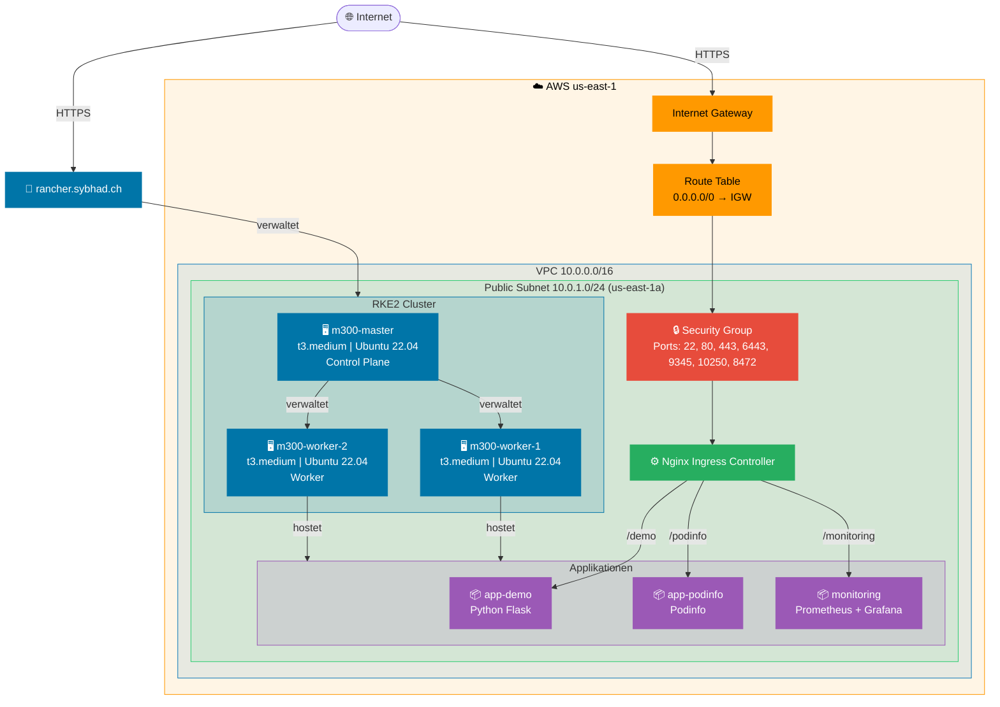
```mermaid
graph TD
    Internet([🌐 Internet])

subgraph AWS["☁️ AWS us-east-1"]
IGW[Internet Gateway]
RT[Route Table\n0.0.0.0/0 → IGW]
subgraph VPC["VPC 10.0.0.0/16"]
subgraph Subnet["Public Subnet 10.0.1.0/24 (us-east-1a)"]
SG["🔒 Security Group\nPorts: 22, 80, 443, 6443, 9345, 10250, 8472"]
subgraph Cluster["RKE2 Cluster"]
MASTER["🖥️ m300-master\nt3.medium | Ubuntu 22.04\nControl Plane"]
WORKER1["🖥️ m300-worker-1\nt3.medium | Ubuntu 22.04\nWorker"]
WORKER2["🖥️ m300-worker-2\nt3.medium | Ubuntu 22.04\nWorker"]
end
subgraph Apps["Applikationen"]
NS1["📦 app-demo\nPython Flask"]
NS2["📦 app-podinfo\nPodinfo"]
NS3["📦 monitoring\nPrometheus + Grafana"]
end
INGRESS["⚙️ Nginx Ingress Controller"]
end
end
end
RANCHER["🐄 rancher.sybhad.ch"]

Internet -->|HTTPS| IGW
IGW --> RT
RT --> SG
SG --> INGRESS
INGRESS -->|/demo| NS1
INGRESS -->|/podinfo| NS2
INGRESS -->|/monitoring| NS3
MASTER -->|verwaltet| WORKER1
MASTER -->|verwaltet| WORKER2
WORKER1 -->|hostet| Apps
WORKER2 -->|hostet| Apps
Internet -->|HTTPS| RANCHER
RANCHER -->|verwaltet| Cluster

style AWS fill:#FF9900,stroke:#FF9900,color:#000,fill-opacity:0.1
style VPC fill:#147EBA,stroke:#147EBA,fill-opacity:0.1
style Subnet fill:#2ECC71,stroke:#2ECC71,fill-opacity:0.1
style Cluster fill:#0075A8,stroke:#0075A8,fill-opacity:0.15
style Apps fill:#9B59B6,stroke:#9B59B6,fill-opacity:0.15
style IGW fill:#FF9900,stroke:#FF9900,color:#000
style RT fill:#FF9900,stroke:#FF9900,color:#000
style SG fill:#E74C3C,stroke:#E74C3C,color:#fff
style INGRESS fill:#27AE60,stroke:#27AE60,color:#fff
style MASTER fill:#0075A8,stroke:#0075A8,color:#fff
style WORKER1 fill:#0075A8,stroke:#0075A8,color:#fff
style WORKER2 fill:#0075A8,stroke:#0075A8,color:#fff
style NS1 fill:#9B59B6,stroke:#9B59B6,color:#fff
style NS2 fill:#9B59B6,stroke:#9B59B6,color:#fff
style NS3 fill:#9B59B6,stroke:#9B59B6,color:#fff
style RANCHER fill:#0075A8,stroke:#0075A8,color:#fff
```

## Terraform – Infrastructure as code (IaC)

Terraform wird verwendet um die gesamte AWS-Infrastruktur automatisiert und reproduzierbar zu provisionieren. Anstatt Ressourcen manuell in der AWS Console zu erstellen, wird die Infrastruktur deklarativ im Code beschrieben.

### Dateistruktur

| Datei                                                   | Beschreibung                                      |
| ------------------------------------------------------- | ------------------------------------------------- |
| [main.tf](../terraform/main.tf)                         | Hauptkonfiguration, definiert alle AWS-Ressourcen |
| [variables.tf](../terraform/variables.tf)               | Variablen (Region, Projektname, etc.)             |
| [outputs.tf](../terraform/outputs.tf)                   | Ausgaben nach dem Apply (VPC-ID, Subnet-ID, etc.) |
| [.terraform.lock.hcl](../terraform/.terraform.lock.hcl) | Lockfile, fixiert die Provider-Version            |

### Netzwerk (VPC)

Folgende Ressourcen wurden mit Terraform in AWS erstellt:

- **VPC** (`10.0.0.0/16`) – privates Netzwerk für den gesamten Cluster
- **Public Subnet** (`10.0.1.0/24`) – Subnetz für die EC2 Nodes
- **Internet Gateway** – verbindet die VPC mit dem Internet
- **Route Table** – leitet Traffic vom Subnetz zum Internet Gateway

Hier sieht man den Output des Terraform apply:

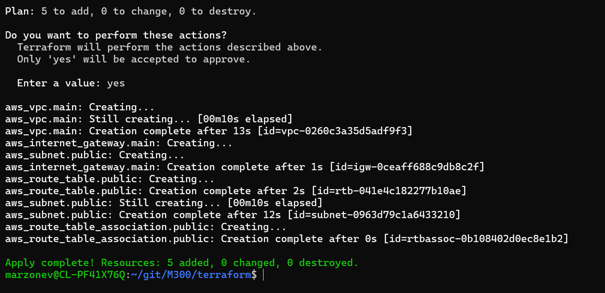

und hier noch in AWS die der erstellte VPC

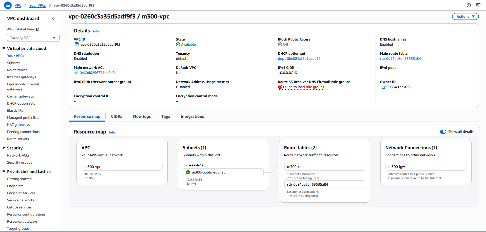

### Security Groups

Security Groups funktionieren wie eine Firewall und kontrollieren welcher Netzwerkverkehr zu den EC2 Nodes erlaubt ist. Für den RKE2 Cluster wurden folgende Ports freigegeben:

| Port  | Protokoll | Zweck                                   |
| ----- | --------- | --------------------------------------- |
| 22    | TCP       | SSH Zugriff                             |
| 6443  | TCP       | Kubernetes API                          |
| 9345  | TCP       | RKE2 Node Registration                  |
| 10250 | TCP       | Kubelet                                 |
| 8472  | UDP       | Flannel VXLAN (Netzwerk zwischen Nodes) |
| 80    | TCP       | HTTP Ingress                            |
| 443   | TCP       | HTTPS Ingress                           |

Ausgehender Traffic ist komplett erlaubt (`0.0.0.0/0`).

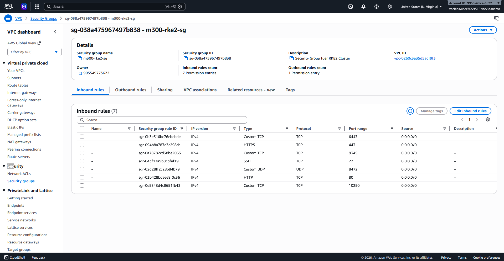

### SSH Key Pair

Für den SSH-Zugriff auf die EC2 Nodes wird ein Key Pair benötigt. Der öffentliche Schlüssel (`m300.pub`) wird via Terraform in AWS importiert und den EC2 Instanzen zugewiesen.

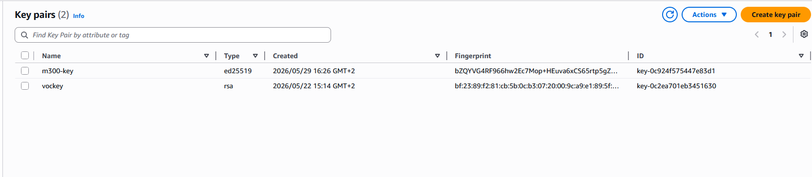

### EC2 Instanzen

Die drei EC2 Instanzen (1 Master, 2 Worker) werden via Terraform provisioniert. Als Betriebssystem wird Ubuntu 22.04 LTS verwendet, da es von RKE2 offiziell unterstützt wird und bis 2027 mit Sicherheitsupdates versorgt wird. Das AMI wird automatisch über einen Filter auf das neueste offizielle Ubuntu 22.04 Image von Canonical gesetzt.

| Node     | Typ       | Storage  |
| -------- | --------- | -------- |
| master   | t3.medium | 20GB gp3 |
| worker-1 | t3.medium | 20GB gp3 |
| worker-2 | t3.medium | 20GB gp3 |

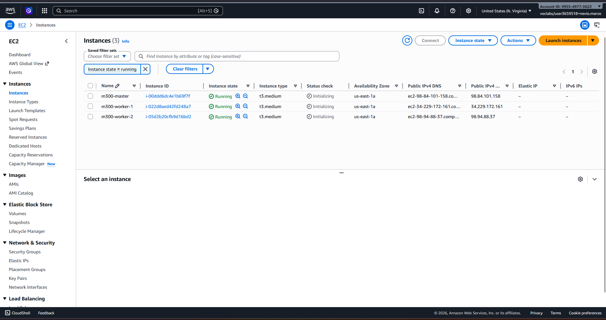

### Wichtige Befehle

| Befehl              | Beschreibung                                   |
| ------------------- | ---------------------------------------------- |
| `terraform init`    | Provider herunterladen, Projekt initialisieren |
| `terraform plan`    | Vorschau anzeigen was erstellt/geändert wird   |
| `terraform apply`   | Infrastruktur in AWS erstellen                 |
| `terraform destroy` | Alle erstellten Ressourcen löschen             |

## RKE2 & Rancher Installation

### RKE2 (via Ansible)

RKE2 wurde mit dem offiziellen Ansible Playbook von Rancher Government Solutions installiert. Das Playbook wurde lokal vom Laptop aus ausgeführt und übernimmt automatisch die Installation auf allen Nodes sowie das Joinen der Worker Nodes in den Cluster.

Das Repo kann einfach geklont werden und dass inventory mit den richtigen Werten bearbeitet werden. Das sieht dann etwa so aus:

``` yaml
---
rke2_cluster:
  children:
    rke2_servers:
      hosts:
        m300-master:
          ansible_host: 54.198.56.112
    rke2_agents:
      hosts:
        m300-worker-1:
          ansible_host: 54.242.40.224
        m300-worker-2:
          ansible_host: 98.80.121.5
```

- **Playbook:** <https://github.com/ranchergovernment/rke2-ansible>
- **Version:** aktuellste stabile Version

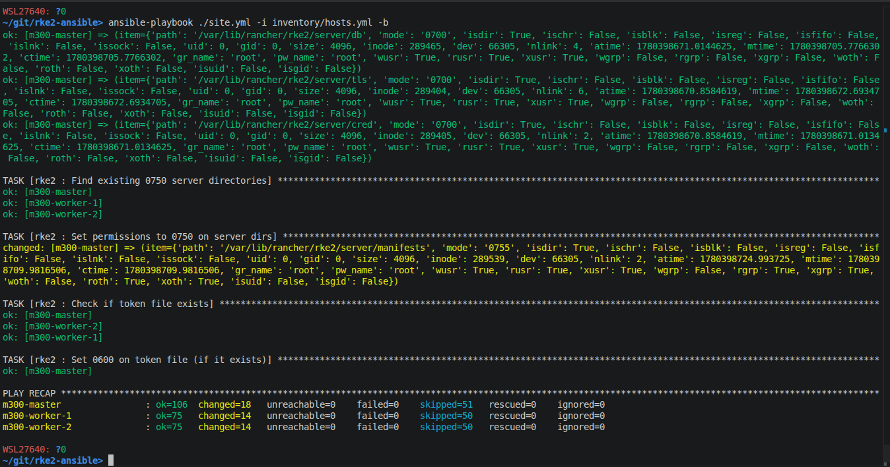

### Rancher (via Helm)

Rancher wurde nach der offiziellen Installationsanleitung via Helm auf dem RKE2 Cluster installiert. Das TLS-Zertifikat wird automatisch via Let's Encrypt ausgestellt und erneuert. Ich verwende dabei meine Domain sybhad.ch

Dafür muss nur ein neuer Namespace erstellt werden und Rancher kann dann einfach mit helm installiert werden. Dazu habe ich diesen Befehl verwendet:

``` bash
helm install rancher rancher-stable/rancher \
  --namespace cattle-system \
  --set hostname=rancher.sybhad.ch \
  --set bootstrapPassword=admin \
  --set ingress.tls.source=letsEncrypt \
  --set letsEncrypt.email=nevio.marzo@edu.tbz.ch \
  --set letsEncrypt.ingress.class=nginx
```

- **URL:** <https://rancher.sybhad.ch>
- **Dokumentation:** <https://ranchermanager.docs.rancher.com/getting-started/installation-and-upgrade/install-upgrade-on-a-kubernetes-cluster>
- **Version:** aktuellste stabile Version

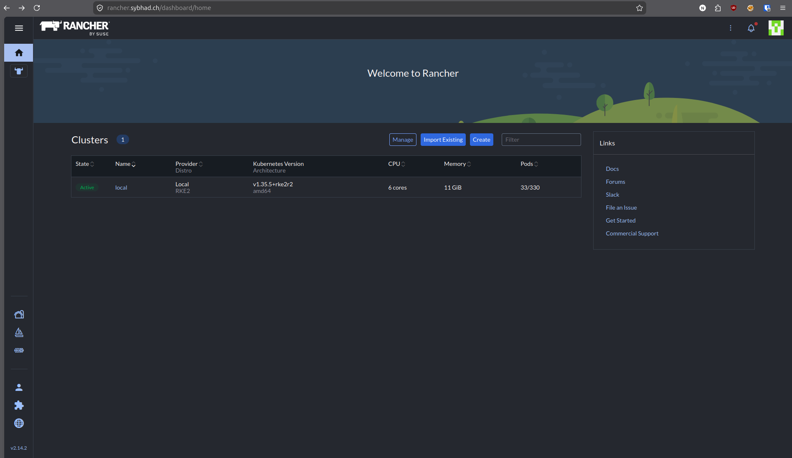

### Cluster Status

Nach der Installation sind alle Nodes als `Ready` registriert:

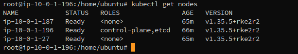

## Cert-Manager & Let's Encrypt

Cert-Manager ist ein Kubernetes-nativer Zertifikatsmanager. Er überwacht Ingress-Ressourcen und beantragt automatisch TLS-Zertifikate bei Let's Encrypt, ohne dass manuell etwas erneuert oder konfiguriert werden muss.

### Installation

Cert-Manager wurde via Helm im Namespace `cert-manager` installiert:

```bash
helm repo add jetstack https://charts.jetstack.io
helm repo update
helm install cert-manager jetstack/cert-manager \
  --namespace cert-manager \
  --create-namespace \
  --set crds.enabled=true
```

### ClusterIssuer

Der ClusterIssuer ist eine clusterweite Ressource die definiert, wie und bei welcher Stelle Zertifikate beantragt werden. In diesem Projekt wird der offizielle Let's Encrypt Produktions-Server verwendet. Die Validierung erfolgt via HTTP01-Challenge. Let's Encrypt ruft eine temporäre URL auf dem Cluster ab um zu bestätigen dass die Domain tatsächlich auf diesen Server zeigt. Der Nginx Ingress Controller übernimmt dabei die Beantwortung dieser Challenge automatisch.

[clusterissuer.yaml](../kubernetes/clusterissuer.yaml)

Hier sieht man noch die Ressource in Rancher

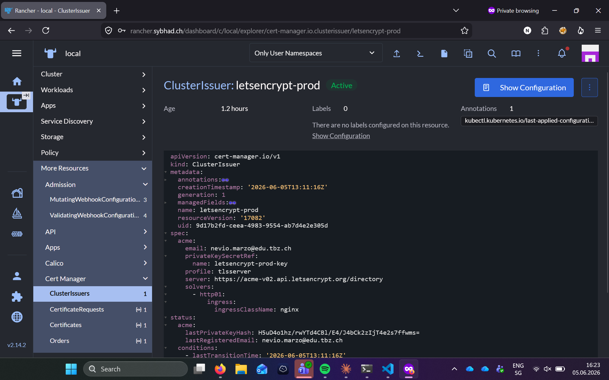

### Funktionsweise

Sobald ein Ingress mit der Annotation `cert-manager.io/cluster-issuer: letsencrypt-prod` erstellt wird, läuft folgender Prozess ab:

1. Cert-Manager erkennt den neuen Ingress
2. Ein Zertifikatsantrag wird bei Let's Encrypt gestellt
3. Let's Encrypt führt die HTTP01-Challenge durch
4. Bei Erfolg wird das Zertifikat ausgestellt und als Kubernetes Secret gespeichert
5. Der Ingress verwendet das Secret automatisch für HTTPS
6. Cert-Manager erneuert das Zertifikat automatisch vor Ablauf

## Podinfo

Podinfo ist eine Open-Source Demo-App die speziell für Kubernetes entwickelt wurde. Sie zeigt Cluster-Infos, Pod-Details, den Hostnamen des antwortenden Pods sowie Kubernetes-Laufzeitinformationen. Zusätzlich stellt sie Prometheus-Metriken unter `/metrics` und Health-Check Endpoints unter `/healthz` und `/readyz` bereit. Für dieses Projekt dient Podinfo als zweite Applikation neben der eigenen Flask Demo-App um die Namespace-Trennung und den Ingress-Routing zu demonstrieren.

### Installation

Podinfo wurde via Rancher unter **Apps** → **Charts** im Namespace `app-podinfo` installiert. Rancher lädt das Helm Chart direkt aus dem offiziellen Podinfo Repository und erstellt automatisch alle nötigen Kubernetes-Ressourcen (Deployment, Service, HorizontalPodAutoscaler).

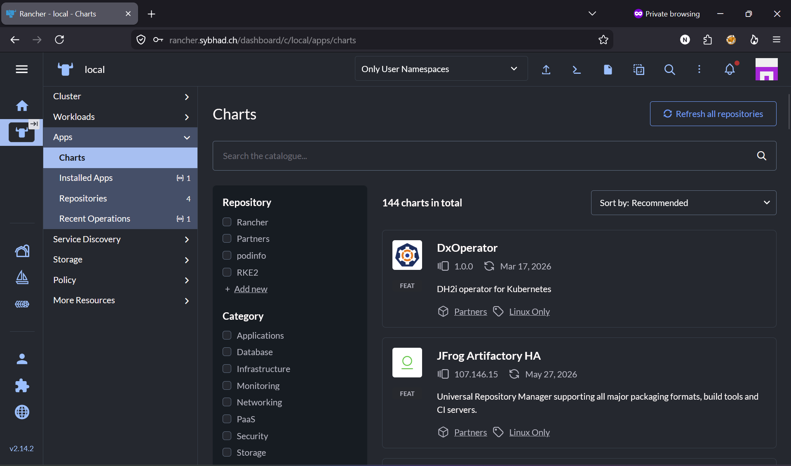

### Ingress

Nach der Installation wurde der Ingress manuell via `kubectl apply` erstellt. Ohne Ingress wäre Podinfo nur clusterweit erreichbar. Der Ingress macht die App über eine öffentliche URL zugänglich.

Die Annotation `cert-manager.io/cluster-issuer: letsencrypt-prod` weist Cert-Manager an, automatisch ein TLS-Zertifikat bei Let's Encrypt zu beantragen. Cert-Manager erstellt dazu eine temporäre HTTP01-Challenge über den Nginx Ingress Controller, Let's Encrypt verifiziert die Domain und stellt das Zertifikat aus. Das Zertifikat wird als Kubernetes Secret `podinfo-tls` gespeichert und vom Ingress automatisch für HTTPS verwendet. Die Erneuerung erfolgt ebenfalls automatisch vor Ablauf.

[podinfo_ingress.yaml](../kubernetes/app-podinfo/ingress.yaml)

Hier sieht man noch die Ressource in Rancher.

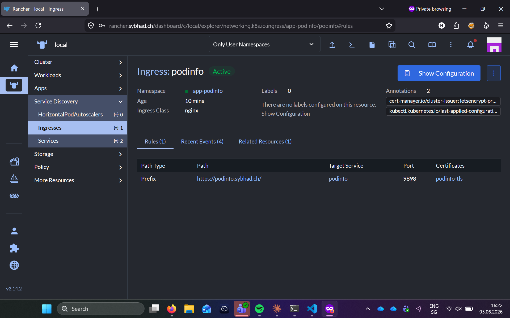

### Erreichbarkeit

| URL                         | Protokoll             |
| --------------------------- | --------------------- |
| <https://podinfo.sybhad.ch> | HTTPS (Let's Encrypt) |

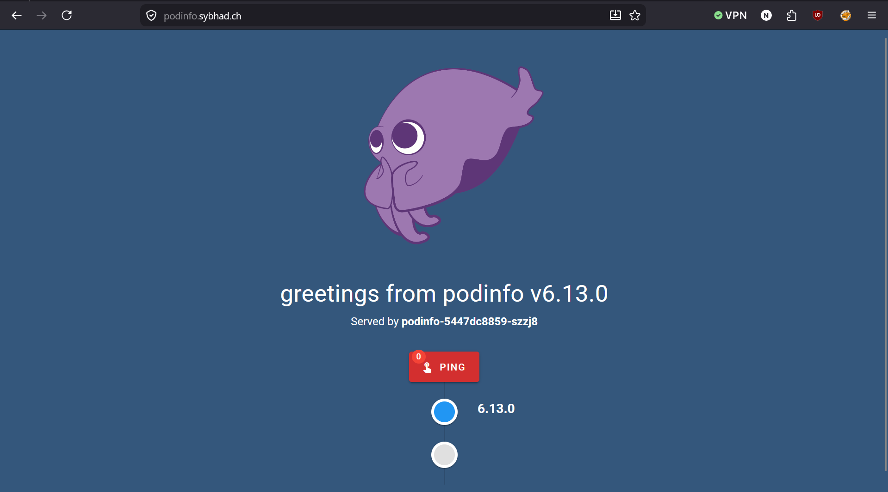

## Prometheus & Grafana

Der kube-prometheus-stack wurde via Rancher unter **Apps** → **Charts** im Namespace `monitoring` installiert. Er bündelt Prometheus, Grafana, Alertmanager und Node Exporter in einem einzigen Helm Chart und ist damit die standardisierte Lösung für Kubernetes-Monitoring.

### Komponenten

| Komponente         | Beschreibung                                                            |
| ------------------ | ----------------------------------------------------------------------- |
| Prometheus         | Sammelt Metriken von allen Nodes und Pods                               |
| Grafana            | Visualisiert die Metriken in Dashboards                                 |
| Alertmanager       | Verwaltet und sendet Alerts                                             |
| Node Exporter      | Sammelt Betriebssystem-Metriken von jedem Node                          |
| Kube State Metrics | Sammelt Kubernetes-spezifische Metriken (Pod-Status, Deployments, etc.) |

### Installation

Der kube-prometheus-stack wurde via Rancher unter **Apps** → **Charts** im Namespace `monitoring` installiert. Rancher lädt das Helm Chart direkt aus dem offiziellen Prometheus Community Repository.

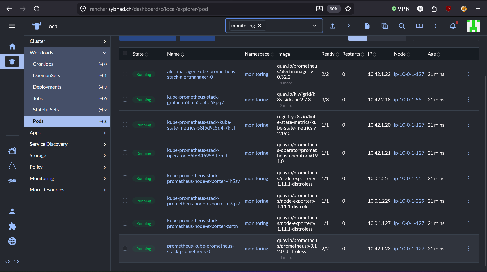

### Ingress

Nach der Installation wurde ein Ingress für Grafana erstellt damit das Dashboard von aussen erreichbar ist. Wie bei den anderen Apps wird das TLS-Zertifikat automatisch via Cert-Manager und Let's Encrypt ausgestellt.

[grafana_ingress.yaml](../kubernetes/monitoring/ingress.yaml)

### Erreichbarkeit

| URL                         | Protokoll             |
| --------------------------- | --------------------- |
| <https://grafana.sybhad.ch> | HTTPS (Let's Encrypt) |

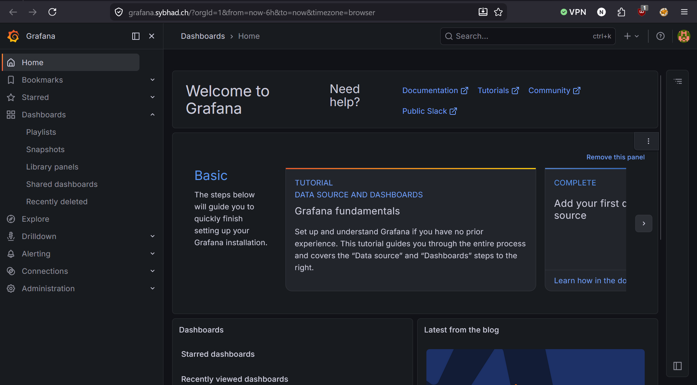

### Dashboards

Der kube-prometheus-stack liefert eine Reihe vorkonfigurierter Grafana-Dashboards mit. Diese zeigen ohne weitere Konfiguration sofort relevante Metriken des Clusters:

| Dashboard               | Beschreibung                                     |
| ----------------------- | ------------------------------------------------ |
| Kubernetes / Nodes      | CPU, RAM und Speicherauslastung pro Node         |
| Kubernetes / Pods       | Ressourcenverbrauch pro Pod                      |
| Kubernetes / Namespaces | Übersicht aller Namespaces mit Ressourcennutzung |
| Node Exporter / Full    | Detaillierte Betriebssystem-Metriken der Nodes   |

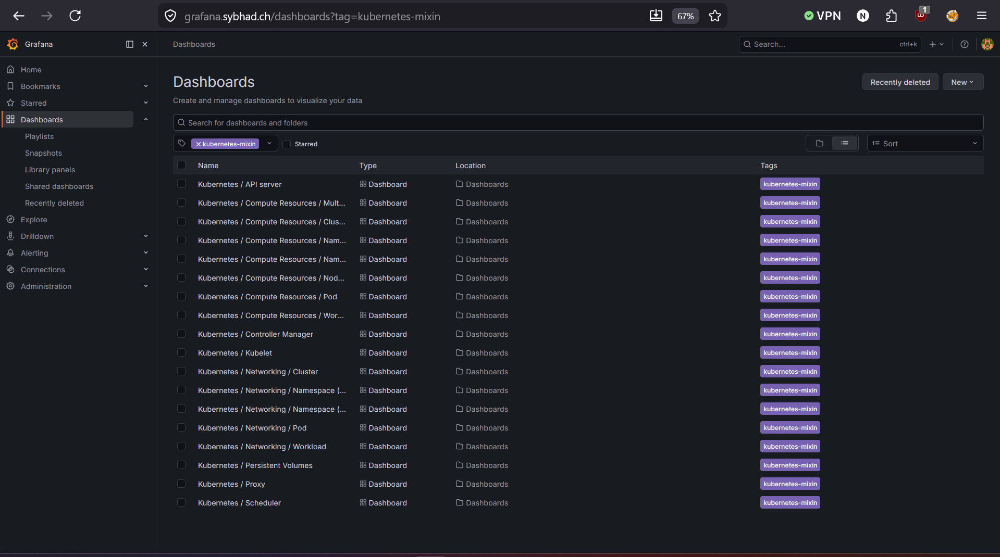

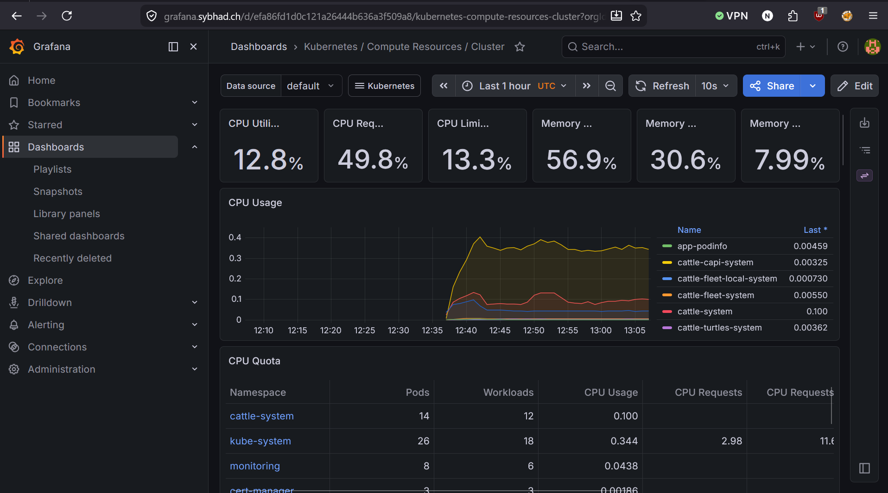

## Demo App

Die Demo App ist eine eigene Python Flask Applikation die speziell für dieses Projekt entwickelt wurde. Sie zeigt Kubernetes-spezifische Laufzeitinformationen wie Pod-Name, Node und Namespace und dient als Grundlage für die CI/CD Pipeline und Rolling Updates.

### Applikation

Die App liest die Umgebungsvariablen `NODE_NAME` und `NAMESPACE` die von Kubernetes automatisch befüllt werden. So ist bei jedem Request ersichtlich welcher Pod auf welchem Node antwortet — das macht Rolling Updates gut sichtbar.

| Endpoint  | Beschreibung                                         |
| --------- | ---------------------------------------------------- |
| `/`       | Hauptseite mit Version, Pod-Name, Node und Namespace |
| `/health` | Health-Check Endpoint                                |

[app.py](../app/app.py)

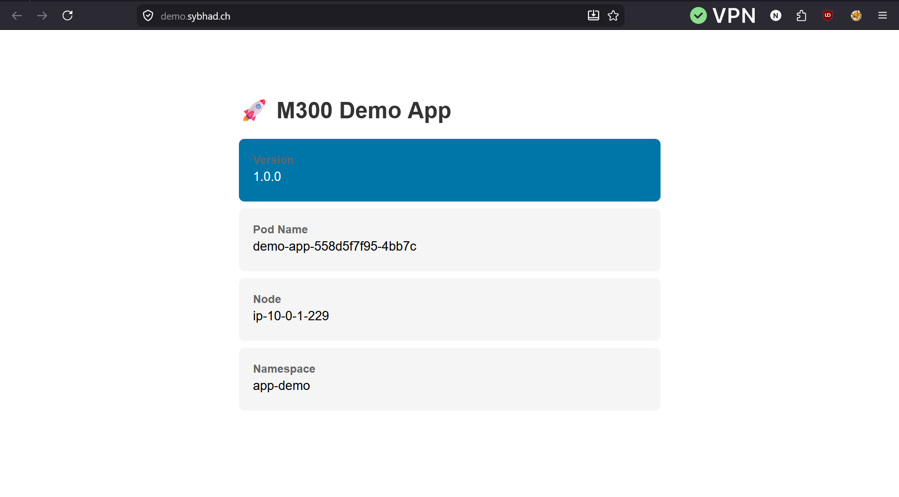

### Docker Image

Die App wird als Docker Image gebaut und in der GitHub Container Registry (GHCR) gespeichert. Das Image wird bei jedem Push auf den `main`-Branch automatisch neu gebaut und gepusht.

[Dockerfile](../app/Dockerfile)

### Kubernetes Manifests

Die App läuft im Namespace `app-demo` mit 2 Replicas. Die Umgebungsvariablen `NODE_NAME` und `NAMESPACE` werden via Kubernetes Downward API automatisch aus den Pod-Metadaten befüllt.

| Datei                                                     | Beschreibung                  |
| --------------------------------------------------------- | ----------------------------- |
| [deployment.yaml](../kubernetes/app-demo/deployment.yaml) | Deployment mit 2 Replicas     |
| [service.yaml](../kubernetes/app-demo/service.yaml)       | Service auf Port 5000         |
| [ingress.yaml](../kubernetes/app-demo/ingress.yaml)       | Ingress mit Let's Encrypt TLS |

### Ingress

Wie bei den anderen Apps wird der Ingress mit der Annotation `cert-manager.io/cluster-issuer: letsencrypt-prod` erstellt. Das TLS-Zertifikat wird automatisch via Cert-Manager und Let's Encrypt ausgestellt.

### Erreichbarkeit

| URL                      | Protokoll             |
| ------------------------ | --------------------- |
| <https://demo.sybhad.ch> | HTTPS (Let's Encrypt) |

## CI/CD Pipeline

Die CI/CD Pipeline automatisiert den gesamten Prozess vom Code-Push bis zum Deployment auf dem Cluster. Sie wird via GitHub Actions umgesetzt und triggert bei jedem Push auf den `main`-Branch wenn Dateien im `app/` Ordner geändert wurden.

### Ablauf

Code Push → GitHub Actions → Docker Image Build → Push zu GHCR → kubectl apply → Rolling Update

### Jobs

Die Pipeline besteht aus zwei aufeinanderfolgenden Jobs:

**build-and-push** — baut das Docker Image und pusht es zu GHCR:

- Checkout des Repos
- Login zu GHCR via `GITHUB_TOKEN`
- Docker Image bauen und pushen

**deploy** — deployed die App auf den Cluster:

- Kubectl Setup
- Kubeconfig aus GitHub Secret laden
- `kubectl apply` auf die Kubernetes Manifests
- `kubectl rollout restart` für Rolling Update

[Pipeline File](../.github/workflows/demo-app.yaml)

### Secrets

| Secret         | Beschreibung                                         |
| -------------- | ---------------------------------------------------- |
| `GITHUB_TOKEN` | Automatisch von GitHub bereitgestellt, für GHCR Push |
| `KUBECONFIG`   | Kubeconfig des RKE2 Clusters, für kubectl Zugriff    |

### Rolling Update

Bei jedem Deployment führt Kubernetes automatisch ein Rolling Update durch — die alten Pods werden schrittweise durch neue ersetzt ohne Downtime. Kubernetes startet zuerst den neuen Pod, wartet bis er `Ready` ist und beendet erst dann den alten.

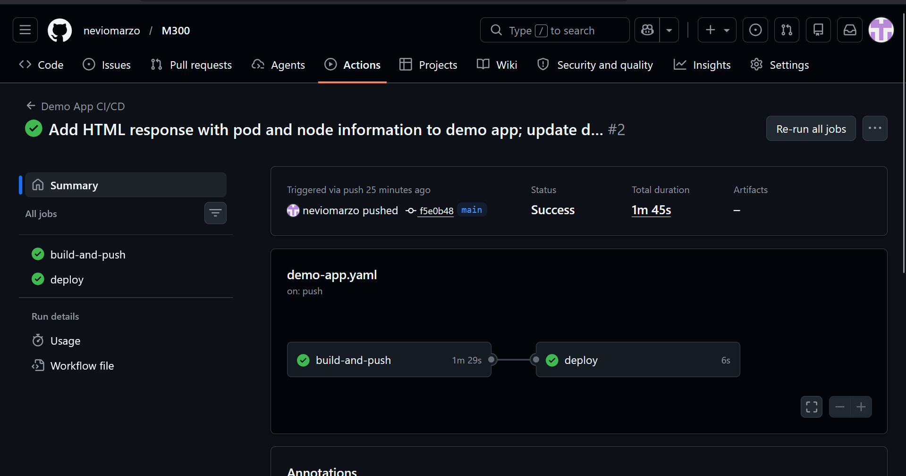

## Konnektivitätstests

### Cluster Status

Alle drei Nodes sind im Status `Ready` und laufen mit RKE2 Version `v1.35.5+rke2r2`:

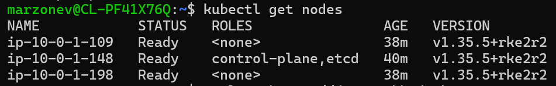

### HTTPS-Erreichbarkeit der Applikationen

Alle Applikationen wurden via `curl -I` auf Erreichbarkeit und TLS-Konfiguration getestet:

| URL                         | Status                 | Bemerkung                                                             |
| --------------------------- | ---------------------- | --------------------------------------------------------------------- |
| <https://demo.sybhad.ch>    | 200 OK                 | Demo-App erreichbar                                                   |
| <https://podinfo.sybhad.ch> | 405 Method Not Allowed | Podinfo unterstützt keine HEAD-Requests (nur GET), normales Verhalten |
| <https://grafana.sybhad.ch> | 302 Found → /login     | Erwartetes Redirect-Verhalten bei nicht eingeloggtem Zugriff          |

Bei allen drei Domains ist der Header `strict-transport-security: max-age=31536000; includeSubDomains` gesetzt — die TLS-Zertifikate von Let's Encrypt sind korrekt ausgestellt und aktiv.

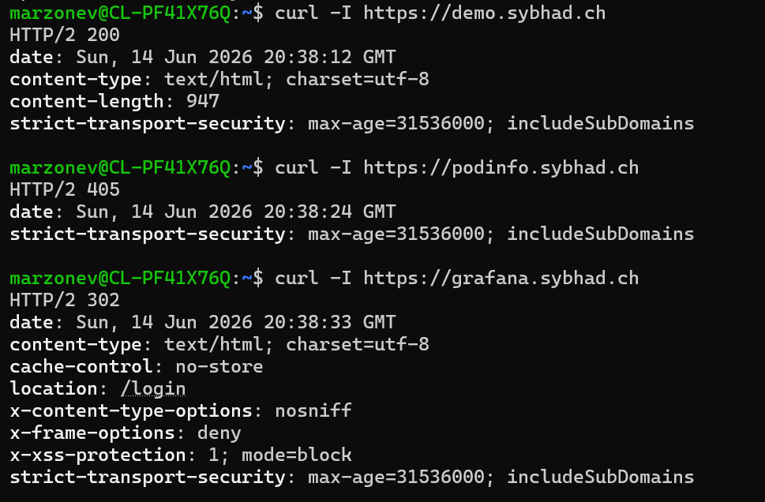

## Fehleranalyse und Protokollierung

Während des Projekts traten verschiedene Fehler auf, die systematisch analysiert und dokumentiert wurden. Die Analyse erfolgte primär über `kubectl logs`, `kubectl describe` und `kubectl get events`.

### Kategorisierung

| Kategorie     | Beschreibung                                    | Beispiele                                               |
| ------------- | ----------------------------------------------- | ------------------------------------------------------- |
| Infrastruktur | Fehler bei der Provisionierung (Terraform, AWS) | Region-Fehlkonfiguration, AMI-Replacement               |
| Cluster/Node  | Fehler im Betrieb der RKE2-Nodes                | NodeNotReady, Pod-Rescheduling                          |
| Pipeline      | Fehler in CI/CD                                 | GHCR-Berechtigung, Deprecation-Warnungen                |
| Konfiguration | Fehlerhafte YAML-Manifeste                      | Rancher-generierte Ingress-YAMLs mit ungültigen Feldern |

### Priorisierung

| Priorität | Kriterium                                                 |
| --------- | --------------------------------------------------------- |
| Hoch      | Verhindert Deployment oder Cluster-Betrieb vollständig    |
| Mittel    | Beeinträchtigt einzelne Komponenten, Workaround vorhanden |
| Niedrig   | Warnungen ohne funktionalen Einfluss                      |

### Beispiel: NodeNotReady Event

Mittels `kubectl get events -n app-demo` wurde folgendes Ereignis identifiziert:

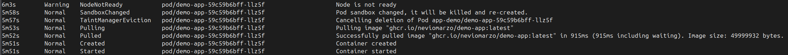

**Analyse:**

- **Kategorie:** Cluster/Node
- **Priorität:** Mittel
- **Ursache:** Ein Node wechselte kurzzeitig in den Status `NotReady` (z.B. durch Ressourcenengpass oder Netzwerk-Hiccup)
- **Auswirkung:** Kubernetes hat den betroffenen Pod automatisch als `SandboxChanged` markiert, neu erstellt und auf einen verfügbaren Node verschoben
- **Lösung:** Keine manuelle Intervention nötig — die Selbstheilungsmechanismen von Kubernetes (Self-Healing) haben den Pod automatisch neu gestartet. Das Deployment blieb durchgehend verfügbar (`2/2 Ready`)
- **Reflexion:** Dieses Verhalten zeigt einen zentralen Vorteil von Kubernetes — transiente Node-Probleme führen nicht zu Downtime, solange genügend Replicas und Worker-Nodes vorhanden sind

### Weitere dokumentierte Fehler

| Fehler                                                                                     | Kategorie     | Priorität | Lösung                                                                                      | Referenz               |
| ------------------------------------------------------------------------------------------ | ------------- | --------- | ------------------------------------------------------------------------------------------- | ---------------------- |
| `terraform apply` 403 UnauthorizedOperation                                                | Infrastruktur | Hoch      | AWS Region von `eu-central-1` auf `us-east-1` korrigiert (Account-Default)                  | Arbeitsjournal Woche 2 |
| AMI-Replacement bei `terraform plan`                                                       | Infrastruktur | Niedrig   | `most_recent = true` führt bei neuem Canonical-Image zu Replacement; für Projekt akzeptiert | Konsole                |
| GHCR `denied: installation not allowed`                                                    | Pipeline      | Hoch      | Workflow Permissions auf "Read and write" gesetzt                                           | GitHub Actions Log     |
| Node.js 20 Deprecation Warning                                                             | Pipeline      | Niedrig   | `FORCE_JAVASCRIPT_ACTIONS_TO_NODE24: true` gesetzt                                          | GitHub Actions Log     |
| Rancher-generiertes Ingress-YAML mit ungültigen Feldern (`vKey`, `cacheObject`, `__clone`) | Konfiguration | Mittel    | Felder manuell entfernt vor `kubectl apply`                                                 | Podinfo Ingress        |
